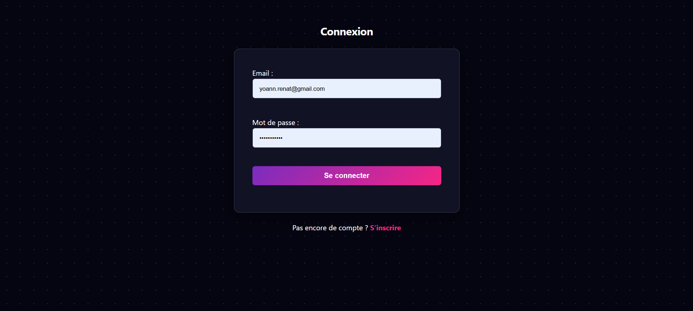
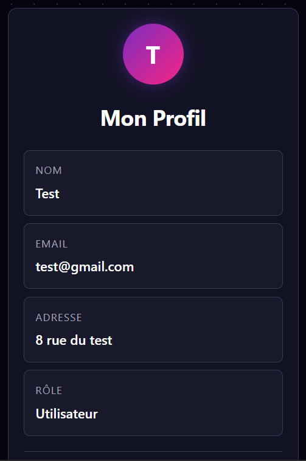

# Système de Gestion d'Utilisateurs (PHP Procédural)

Ce projet est une application web complète de gestion d'utilisateurs développée en **PHP natif (procédural)**. 
Il a été réalisé dans un but pédagogique pour maîtriser les interactions avec une base de données MySQL, la gestion des sessions et la sécurisation des formulaires, sans l'utilisation de frameworks ou de Programmation Orientée Objet (POO).

L'interface a été entièrement stylisée avec une identité visuelle moderne (**Dark Mode**, dégradés) et est totalement **Responsive** (adaptée mobiles et tablettes).

## 📸 Aperçu

### Page de Connexion


### Tableau de Bord (Responsive)


## 📋 Fonctionnalités

L'application gère deux types de rôles : **Utilisateur** et **Administrateur**.

### Partie Publique
* **Inscription :** Création de compte avec validation des données (Regex pour l'email et le mot de passe, confirmation du mot de passe).
* **Connexion :** Authentification sécurisée (email/mot de passe).

### Espace Utilisateur
* Visualisation des informations du profil (Nom, Email, Adresse, Rôle).
* **Suppression du compte :** L'utilisateur peut supprimer définitivement ses propres données.

### Espace Administrateur (Back-office)
* Accessible uniquement aux utilisateurs ayant le rôle `admin`.
* **Tableau de bord :** Liste complète des utilisateurs avec leur rôle.
* **CRUD complet :**
    * **Ajouter** un utilisateur (avec choix du rôle).
    * **Modifier** les informations d'un utilisateur (Nom, Email, Adresse, Rôle).
    * **Supprimer** un utilisateur.

## 🛠 Choix Techniques

Conformément au cahier des charges, le projet respecte des contraintes techniques strictes pour garantir la sécurité et la clarté du code :

* **Architecture :** PHP Procédural (code structuré en fonctions réutilisables dans `fonctions.php`).
* **Base de données :** MySQL avec utilisation de l'extension **PDO**.
* **Sécurité :**
    * **Requêtes préparées** systématiques pour éviter les injections SQL.
    * **Hashage des mots de passe** avec `password_hash()` (Argon2/Bcrypt).
    * **Nettoyage des entrées** avec `trim()` et protection XSS avec `htmlspecialchars()` à l'affichage.
    * **Validation :** Utilisation de Regex pour forcer la complexité des mots de passe (8 caractères, lettres et chiffres).
* **Interface :** HTML5 / CSS3 simple.

## 💾 Structure de la Base de Données

Le projet utilise deux tables liées :

1.  **`roles`** : Contient les définitions des rôles (`id`, `role_name`).
    * 1 : Admin
    * 2 : User
2.  **`users`** : Contient les informations utilisateurs (`id`, `nom`, `email`, `adresse`, `password`, `role_id`).
    * Clé étrangère `role_id` vers la table `roles`.

## 🚀 Installation

Pour tester le projet localement :

1.  Clonez ce dépôt.
2.  Importez le fichier `gestion_users.sql` dans votre serveur de base de données (phpMyAdmin / MySQL).
3.  Configurez la connexion à la base de données dans le fichier `fonctions.php` (fonction `getDB`) :
    ```php
    $host = "localhost";
    $dbname = "gestion_users";
    $username = "root";
    $password = ""; // Votre mot de passe
    ```
4.  Lancez le serveur (via WAMP, XAMPP ou `php -S localhost:8000`).

## 👤 Auteur

Projet réalisé par Yoann Renat dans le cadre du module de développement PHP.